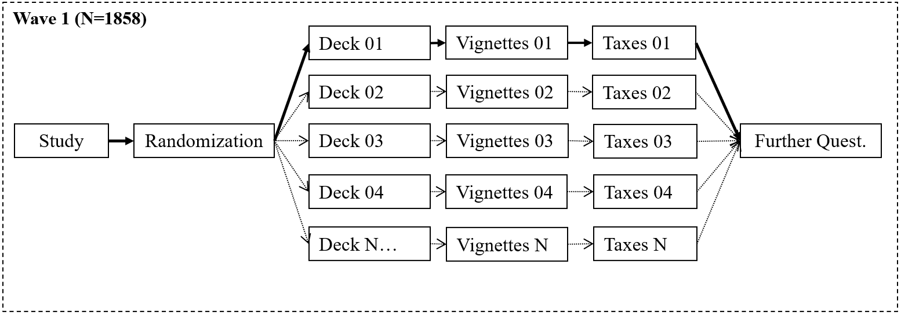
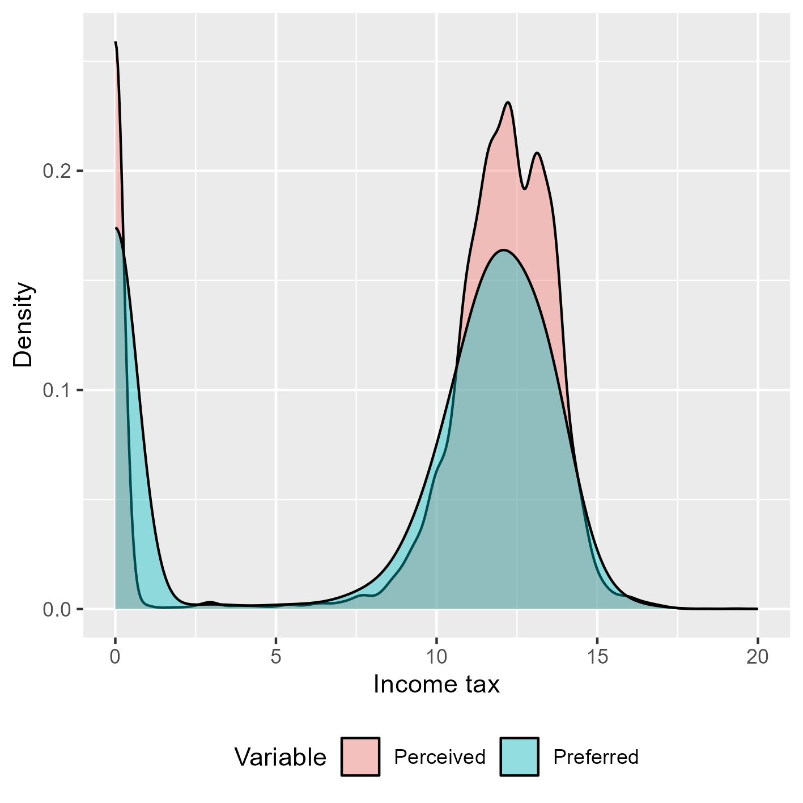
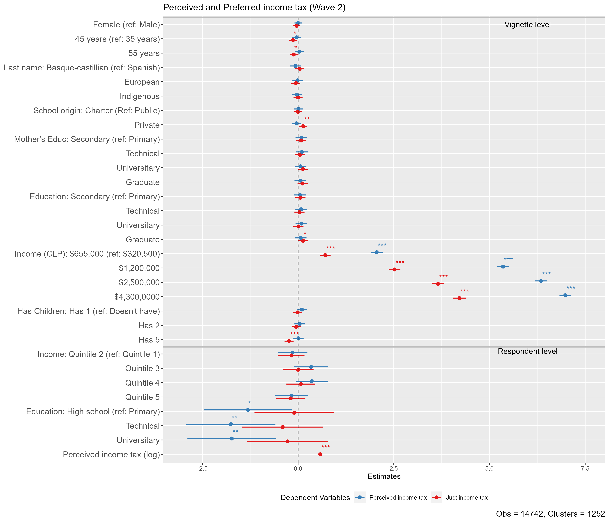

class: middle title-slide

```{r xaringanExtra, echo = FALSE}
  xaringanExtra::use_progress_bar(color = "red", location = c("top"))
```

.pull-left-narrow[
<br><br><br><br><br><br><br>


.small[.red[]
]
]


.pull-right-wide[
.right[

.content-box-red[
## Perceptions and preferences about income taxes: A factorial survey approach

]

----

.espaciosimplelineas[
.small[
Julio Iturra -  Bremen Int. Graduate School of Social Sciences
[jiturra@bigsss.uni-bremen.de](jiturra@bigsss.uni-bremen.de)
<br>
Juan Carlos Castillo -  Universidad de Chile
<br>
Luis Maldonado - Pontificia Universidad Católica de Chile
] 
]

.small[ESRA Conference - 18th July 2023]
]
]


---
class: inverse animated slideInRight

## .red[Perceptions and preferences about income taxes
]

.pull-right[
.large[
1. Introduction
2. Hypothesis
3. Methodology
4. Results
5. Discussion
]
]

---
class: inverse 

## .red[Perceptions and preferences about income taxes
]

.pull-right[
.large[
1. .yellow[Introduction]
2. Hypothesis
3. Methodology
4. Results
5. Discussion
]
]
 
---
<br>
.pull-left[
  .content-box-gray[
### Attitudes toward economic inequality
  - Subjective inequality  (Janmaat, 2013)
    - Perception (_How is it_)  
    - Preference (_How it should be_)
  - Perception anchors economic inequality justification (Wegener, 1987;Castillo, 2011)   
  ] 
]

.pull-right[
  .content-box-purple[
### Public support for taxation
  - Self-interest and policy support (Meltzer & Richard, 1981; McCall & Kenworthy, 2009)
  - Deservingness opinions: merit and need (Van Oorschot, 2000;Sachweh & Eicher, 2023) 
    
  ] 
]


---
class:inverse middle left

###.yellow[.small[_What is the role of self-interest and deservingness opinions on perceived and preferred income tax?_]]


---
class: inverse animated slideInRight

## .red[Perceptions and preferences about income taxes
]
.pull-right[
.large[
1. Introduction
2. .yellow[Hypothesis]
3. Methodology
4. Results
5. Discussion
]
]

---
## Hypothesis

.medium[

> H1: Higher status vignettes will obtain a larger preferred income tax. 

> H2: Respondents of lower status will perceive lower income tax.

> H3: Respondents of higher status will prefer less income tax than those of lower status
<!-- > H4: Respondents that support meritocratic ideals will prefer less income tax. -->

> H4: Results will remain stable over time (two waves)] 

.small[
* Pre-registration: [https://osf.io/vpz86](https://osf.io/vpz86)
]
---
class: inverse animated slideInRight

## .red[Perceptions and preferences about income taxes
]

.pull-right[
.large[
1. Introduction
2. Hypothesis
3. .yellow[Method]
4. Results
5. Discussion
]
]

---
## Data and methods
----

.pull-left[


.bold[Data:]


* Online panel survey using quotas (Age, Gender, Education). 
* December 2019 ( $N_1$ = 1858) - January 2020 ( $N_2$ = 1252) 
* _Method:_  Multilevel regression models   
]

.pull-right[

.bold[Vignette design:]

- 8 dimensions 
- D-efficient solution ( $D$ = 99.7) 
- sample of 120 vignettes  
- 10 Decks containing 12 vignettes each 
]

---
.pull-left[
<br>
### Dimensions
<br><br><br><br><br><br><br><br><br><br><br><br><br><br>
]


---
class:center middle


---
## Example

.medium[
<!-- In the following section we are interested in your opinion on income tax, which is the tax that is deducted from some people's monthly salaries according to the amount of money they received when performing a job under contract. By way of clarification, this tax is different to the and it is also different from the withholding tax for fee receipts.   You will be presented with descriptions of people with different characteristics and their gross salary (before deductions), as in the following table. (before deductions), as in the following example: -->
 
> Mr. Pailahueque is 55 years old, he studied in a municipal school and completed postgraduate studies. He has two children and his mother completed high school. He currently receives a gross monthly salary of $655,000 pesos.
 
 After the presentation of each description, two questions are asked:   
 - How much do you think the person described **currently pays** in income tax?
 - How much do you think the person described **should pay** in income tax?
 
The answers to these questions should be answered with amounts in Chilean pesos. 
 
]

.content-box-green[
.medium[**Note:** In Chile (2019) people with a earned income **below** $669,910 (monthly) are exempt from income taxes]
]

---
class: middle, center


---
class: middle, center

---
### Perceived and preferred Income taxes

.pull-left[

- Responses with a value of $0 are present for both perceived (~18%) and preferred (~30%) income tax 

- Perception: around 15% are accurate ( $\le$ $655.000)

- For modelling zeros (add a constant value of $k_i$ = 1):

$$I_{tax}= \ln\big(\text{income tax} + k_i\big)$$

]

.pull-right[  

.center[]

]

---

## Independent variables
----
.pull-left[
.content-box-purple[

### Vignettes (L1)

* sociodemographic 

* SES and SES of origin 

* number of children

]
]
<br>
<br>
<br>
.pull-left[
.content-box-green[

### Respondent (L2)

* Educational level

* Household income quintile 

* sociodemographic

]
]

---
class: inverse animated slideInRight

## .red[Perceptions and preferences about income taxes
]

.pull-right[
.large[
1. Introduction
2. Hypothesis
3. Methodology
4. .yellow[Results]
5. Discussion
]
]
---

.pull-left-narrow[
<br>
### Wave 1

]

.pull-right-wide[
.center[]
]
---

.pull-left-narrow[
<br>
### Wave 2
]
  
.pull-right-wide[
.center[]
]

---

.pull-left-narrow[
<br>
### Longitudinal
]
  
.pull-right-wide[
.center[]
]
 

---
class: inverse animated slideInRight

## .red[Perceptions and preferences about income taxes
]

.pull-right[
.large[
1. Introduction
2. Hypothesis
3. Methodology
4. Results
5. .yellow[Discussion]
]
]

---
# Discussion and future 

<!-- > H1: Higher status vignettes will obtain a larger preferred income tax.  -->

<!-- > H2: Respondents of lower status will perceive lower income tax. -->

<!-- > H3: Respondents of higher status will prefer less income tax than those of lower status -->

<!-- > H4: Results will remain stable over time (two waves)]  -->


- SES of *origin* (School) and *current* SES (income) of vignettes increases tax preferences (H1 ✓). 

- *Need* as the number of children decreases the prefered tax amount 

- *Respondent status:* Education matters only for lower perceived income taxes (H2 ✓), but not for preferences (H3 ✖)

- Results are stable on time for income and education (H4 ✓)

- Future 🔍: operationalisation for DV + longitudinal effects 

---
class: roja middle center

# Thank you!


.right[
.yellow[More information: 

[jiturra@bigsss.uni-bremen.de](jiturra@bigsss.uni-bremen.de)


[github.com/juancarloscastillo/factorial-impuestos](https://github.com/juancarloscastillo/factorial-impuestos)

]]


---
class: middle title-slide
.pull-left-narrow[

<br>
<br>
<br>
<br>
<br>
<br>
<br>


.small[.red[FONDECYT N°1181239 Political socialisation and citizenship education]
]
]


.pull-right-wide[
.right[

.content-box-red[
## Perceptions and preferences about income taxes: A factorial survey approach

]

----
.espaciosimplelineas[
.small[
Julio Iturra -  Bremen Int. Graduate School of Social Sciences
[jiturra@bigsss.uni-bremen.de](jiturra@bigsss.uni-bremen.de)
<br>
Juan Carlos Castillo -  Universidad de Chile
<br>
Luis Maldonado - Pontificia Universidad Católica de Chile
] 
]

.small[ESRA Conference - 18th July 2023]
]
]

