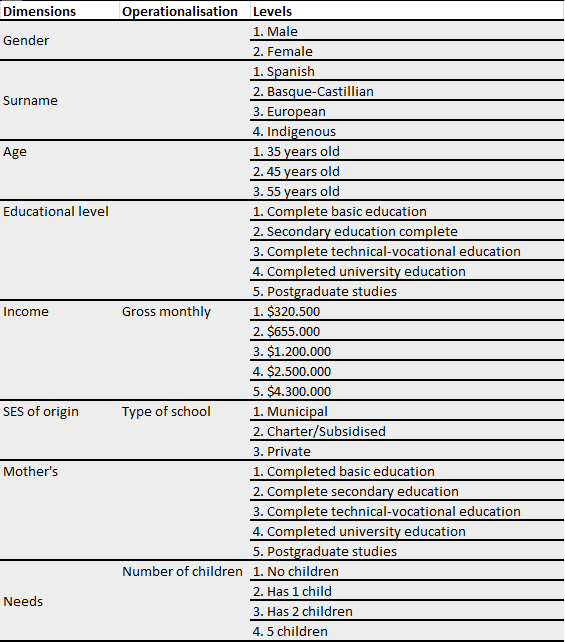
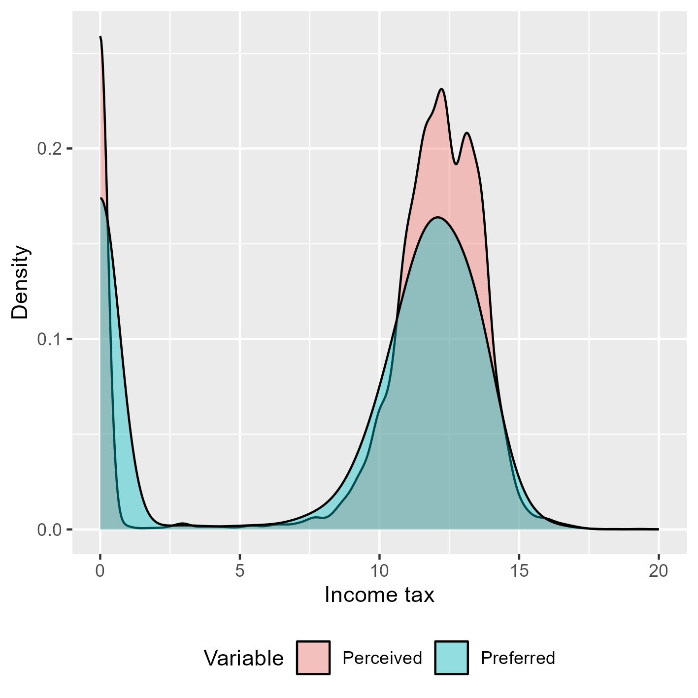
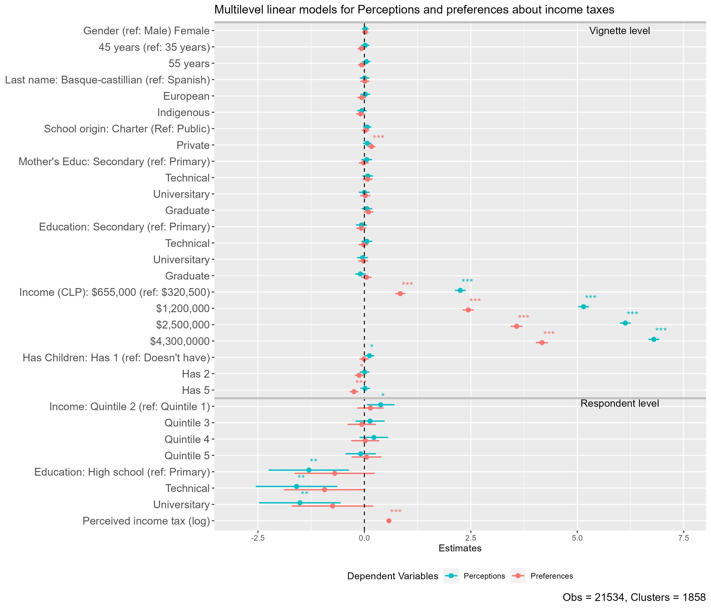

class: middle title-slide

```{r xaringanExtra, echo = FALSE}
  xaringanExtra::use_progress_bar(color = "red", location = c("top"))
```

.pull-left-narrow[
<br><br><br><br><br><br><br>


.small[.red[]
]
]


.pull-right-wide[
.right[

.content-box-red[
## Perceptions and preferences about income taxes: A factorial survey approach

]

----

.espaciosimplelineas[
.small[
Julio Iturra Sanhueza -  BIGSSS<br>
[jiturra@bigsss.uni-bremen.de](jiturra@bigsss.uni-bremen.de)
<br><br>
Juan Carlos Castillo -  Universidad de Chile
<br>
Luis Maldonado - Pontificia Universidad Católica de Chile
] 
]

.small[ESRA Conference - 18th July 2023]
]
]


---
class: inverse animated slideInRight

## .red[Perceptions and preferences about income taxes
]

.pull-right[
.large[
1. Introduction
2. Hypotheses
3. Methodology
4. Results
5. Discussion
]
]

---
class: inverse 

## .red[Perceptions and preferences about income taxes
]

.pull-right[
.large[
1. .yellow[Introduction]
2. Hypotheses
3. Methodology
4. Results
5. Discussion
]
]
 
---
<br>
.pull-left[
  .content-box-gray[
### Attitudes toward economic inequality
  - Subjective inequality  (Janmaat, 2013)
    - Perception (_How is it_)  
    - Preference (_How it should be_)
  - Perception anchors economic inequality justification (Wegener, 1987;Castillo, 2011)   
  ] 
]

.pull-right[
  .content-box-purple[
### Public support for taxation
  - Self-interest and policy support (Meltzer & Richard, 1981; McCall & Kenworthy, 2009)
  - Deservingness opinions: merit and need (Van Oorschot, 2000;Sachweh & Eicher, 2023) 
    
  ] 
]


---
class:inverse middle center

##.yellow[.small[_What is the role of self-interest and deservingness opinions on perceptions and preferences about income taxes?_]]


---
class: inverse animated slideInRight

## .red[Perceptions and preferences about income taxes
]
.pull-right[
.large[
1. Introduction
2. .yellow[Hypotheses]
3. Methodology
4. Results
5. Discussion
]
]

---
## Hypotheses

<br>

.medium[

> H1: Higher status vignettes will obtain a larger preferred income tax. 

> H2: Respondents of lower status will perceive lower income tax.

> H3: Respondents of higher status will prefer less income tax than those of lower status

]

.small[
* Pre-registration: [https://osf.io/vpz86](https://osf.io/vpz86)
]

---
class: inverse animated slideInRight

## .red[Perceptions and preferences about income taxes
]

.pull-right[
.large[
1. Introduction
2. Hypotheses
3. .yellow[Method]
4. Results
5. Discussion
]
]

---

## Data and methods
----

.pull-left[


.bold[Data:]


* Online panel survey using quotas (Age, Gender, Education). 
* Chile - 2019 ( $N$ = 1858) 
* _Method:_  Multilevel regression models   
]

--

.pull-right[

.bold[Vignette design:]

- 8 dimensions 
- D-efficient solution ( $D$ = 99.7) 
- sample of 120 vignettes  
- 10 Decks containing 12 vignettes each 
]

---
.pull-left[
<br>
### Dimensions
<br><br><br><br><br><br><br><br><br><br><br><br><br><br>
]




---
## Vignettes and outcomes


--

.medium[
> Mr. Pailahueque is 55 years old, he studied in a municipal school and completed postgraduate studies. He has two children and his mother completed high school. He currently receives a gross monthly salary of $655,000 pesos.]


--

.medium[
After the presentation of each description, two questions are asked:   
 - How much do you think the person described **currently pays** in income tax?
 - How much do you think the person described **should pay** in income tax?


The answers to these questions should be answered with amounts in Chilean pesos. 

]

--

.content-box-green[
.medium[**Note:** In Chile (2019) people with a earned income **below** $669,910 (monthly) are exempt from income  taxes]
]

---
### Perceptions and preferences about taxes

.pull-left[

- Responses with a value of $0 are present for both perceptions (~18%) and preferences (~30%) about income taxes 

- Perception: around 15% response accuracy (vig's $\le$ $655,000)

- For modelling zeros (add a constant value of $k_i$ = 1):

$$I_{tax}= \ln\big(\text{income tax} + k_i\big)$$

]

.pull-right[  

.center[]

]

---

## Independent variables
----
.pull-left[
.content-box-purple[

### Vignettes (L1)

* sociodemographic 

* SES and SES of origin 

* number of children

]
]
<br>
<br>
<br>
.pull-left[
.content-box-green[

### Respondent (L2)

* educational level

* household income quintile 

* sociodemographic

]
]

---
class: inverse animated slideInRight

## .red[Perceptions and preferences about income taxes
]

.pull-right[
.large[
1. Introduction
2. Hypotheses
3. Methodology
4. .yellow[Results]
5. Discussion
]
]
---

.pull-left-narrow[
<br>
### Results

]

.pull-right-wide[
.center[]
]

 

---
class: inverse animated slideInRight

## .red[Perceptions and preferences about income taxes
]

.pull-right[
.large[
1. Introduction
2. Hypotheses
3. Methodology
4. Results
5. .yellow[Discussion]
]
]

---
class: inverse

.pull-left[

### .red[Dicussion]

- SES of *origin* (School as status marker) and *current* SES (income) of vignettes increases tax preferences (H1 ✓). 

- *Need* as the number of children decreases income tax preferences

- *Respondent status:* Education matters only for lower perceived income taxes (H2 ✓), but not for preferences (H3 ✖)
]

.pull-right[

### .red[Future research]

- alternative models for accounting for $0 in DV

- the role of perceptions and preferences about **meritocracy** 

- longitudinal analysis employing second wave 
]
---
class: roja middle center

# Thank you!

.right[
.yellow[More information: 

[jiturra@bigsss.uni-bremen.de](jiturra@bigsss.uni-bremen.de)

[bit.ly/factorial-taxes](bit.ly/factorial-taxes)

]]


---
class: middle title-slide
.pull-left-narrow[
<br><br><br><br><br><br><br>


.small[.red[]
]
]


.pull-right-wide[
.right[

.content-box-red[
## Perceptions and preferences about income taxes: A factorial survey approach

]

----

.espaciosimplelineas[
.small[
Julio Iturra Sanhueza -  BIGSSS<br>
[jiturra@bigsss.uni-bremen.de](jiturra@bigsss.uni-bremen.de)
<br><br>
Juan Carlos Castillo -  Universidad de Chile
<br>
Luis Maldonado - Pontificia Universidad Católica de Chile
] 
]

.small[ESRA Conference - 18th July 2023]
]
]
<!-- --- -->

<!-- perception and preferences  for income tax -->


<!-- -- meter transiciones en examples -->

<!-- correccion hypotheses -->

<!-- examples and outcomes -->

<!-- editar website -->

<!-- chequear carpetas esra-2023 -->

<!-- bit.ly -->

<!-- revisar titulos de plot de regresion -->

<!-- Main results -->

<!-- Future research -->

<!-- - longitudinales  -->
<!-- - quantile  -->


